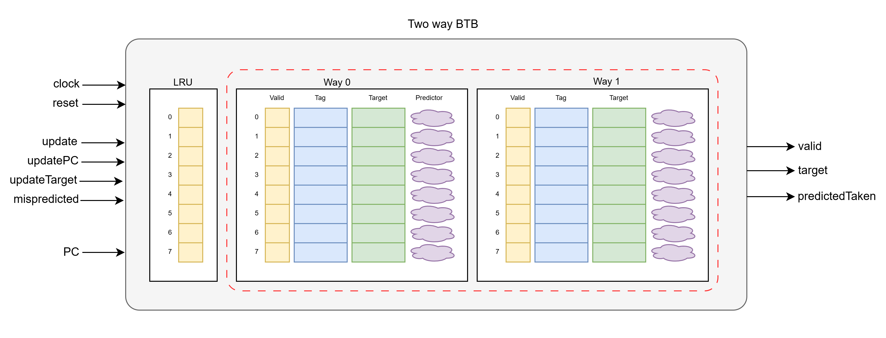
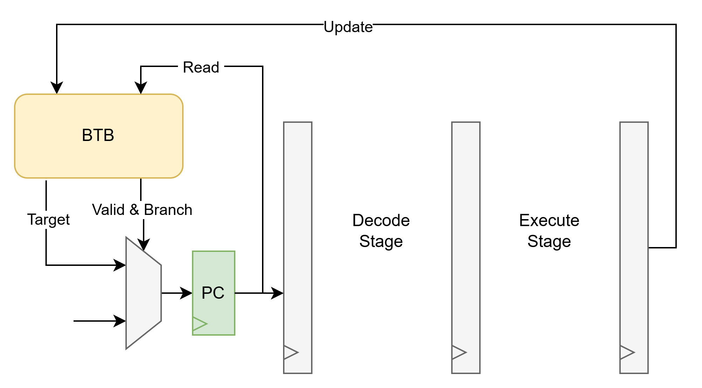
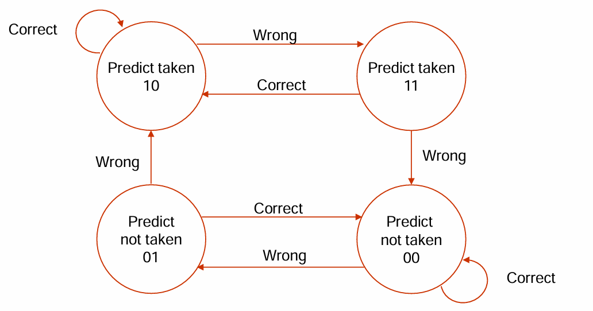

<h1 align="center"> Two-Way Branch Target Buffer </h1>

This is a **Two Way Set Associative Branch Target Buffer (BTB)** with integrated **2-bit branch predictor**  targetted for a (RISCV) **pipelined processor** to **improve the branch prediction performance**.

## What is a Branch Target Buffer?

A Branch Target Buffer (BTB) is a lookup table (cache memory) in pipelined processors that stores the target addresses of recently taken branches, allowing the processor to predict and fetch the next instruction before the branch instruction is fully decoded, improving pipeline efficiency.

This is possible due to the fact that the target address (calculated from PC and offset) for a particular branch remains constant during program execution.

## Specifications

- Number of ways: 2
- Number of sets: Configurable
- Branch prediction: 2 bit dynamic prediction scheme
- Write back policy: Least Recently Used (LRU)
- Architecture: 32-bit

Please see [BTB_specification](docs/BTB_specification.pdf) to find design implementation specifications.

### BTB Architecture


### BTB Integration with Pipelined Processor


### 2-bit Branch Prediction Scheme
For loops, the hit rate may be improved by using two bits for branch prediction. A prediction must be wrong twice before it is changed.

- **00: Strong not taken** -> Predict not taken
- **01: Weak not taken**   -> Predict not taken
- **10: Strong taken**     -> Predict taken
- **11: Weak taken**       -> Predict taken



## How to use

- Prerequities : Need `SBT` (and `Java`) installed.

1. Clone the repository
```
git clone git@github.com:tharinduSamare/TwoWay_BranchTargetBuffer.git
cd TwoWay_BranchTargetBuffer
```

2. Build chisel project ([BTB.scala](src/main/scala/BTB.scala)) with `SBT` and generate verilog code.
```
sbt run
```

3. Run chisel testbench ([BTB_tb.scala](src/test/scala/BTB_tb.scala))
```
sbt test
```

4. Run SystemVerilog testbench ([BTB_tb.sv](src/test/sv/BTB_tb.sv))

- The SystemVerilog testbench can be used to verify the generated verilog design. This is much more robust testbench than the chisel testbench with lot of randomization and lot of testcases to cover all corner cases.
- [This EDA Playground](https://edaplayground.com/x/KBRE) has the generated BTB verilog design and the verilog testbench. **You can try it by yourself!**

## Credits

This was designed under the class project of [EIT-EIS-572-M-7 : Architecture of Digital Systems-I](https://eit.rptu.de/fgs/eis/teaching/85-571) in Winter Semester 2024/25 [ESY Masters Program](https://eit.rptu.de/en/esy) at [RPTU](https://rptu.de/).

